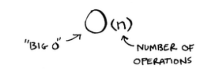
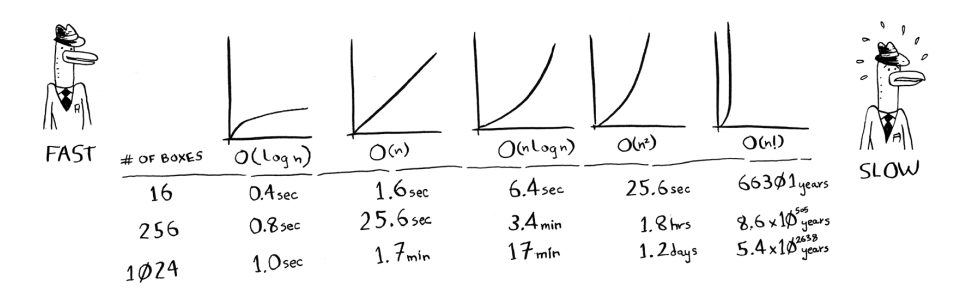

# CS Ed Week Curriculum
A workshop for getting young people interested in computer science
## General Info
- default language is Python, but participants can use whatever they choose
- Participants will use Replit for coding
- cooperation and teamwork is encouraged
- Topics covered:
  - Basics of Python
  - Control flow in Python
  - Data Structures
  - Algorithms
  - Debugging

## Part 3(?): Data Structures and Algorithms
### Binary Search
- Takes a sorted list of elements; if the element you are searching for is in the list, it returns the position.
- The goal of a binary search is to find the elements in as few guesses as possible
  - Think of a number guessing game, where you have to guess the number the other person is thinking, between 1-100. They then tell you if its too high or too low.
  - You could start guessing 1, 2, 3, 4, 5... until you get the number
  - Or, you could start with the middle number and eliminate half of the possible results.
      - For numbers 1-100, your first guess would be 50.
      - The person says 50 is too high. Your new list of numbers is 1-49. You guess 25.
      - The person says 25 is too high. Your new list of numbers is 1-24. The middle value is 13.
      - The person says 13 is too high. Your new list of numbers is 1-12. The middle value is 7.
      - The person says 7 is too high. Your new list of numbers is 1-6. You guess 4.
      - The person says 4 is too high. Your new list is 1-3. You guess 2.
      - The person says 2 is too high. __Therefore, correct value is 1.__
  - For a list of 100 elements, binary search will never take more than 7 steps, or guesses. Simple search on the other hand, where you guess each element in order, can take as many guesses as there are elements.
### Big O Notation
- Tells us how fast an algorithm is
- Not a measure of time like seconds, but how many operations it will take to search through or sort through a list of *n* elements
- Different algorithm's run times grow at different rates
- Assuming one operation takes 1ms:

- Here is what Big O notation looks like:

- Common Big O run times:
    - O(log *n*), known as *log time* - binary search
    - O(n), known as *linear time* - simple search
    - O(n!) - really slow algorithm, like the travelling salesman

- What is a logarithms?
  - Logs are like a flip of exponents
  - log10100 means "How many 10s must we multiply to get 100?" The answer is 2. 

  - log without a subscript means log2
### Arrays vs. Linked Lists
### Selection Sort

Credits: *Grokking Algorithms* by Aditya Y. Bhargava
