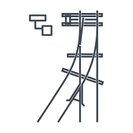

# CS Ed Week Curriculum

A workshop for getting young people interested in computer science.

## General Info

- Default language is Python, but participants can use whatever they choose.
- Participants will use Replit for coding.
- Cooperation and teamwork is encouraged!
- Topics covered:
  - Basics of Replit
  - Variables
  - Control Flow
  - Lists
  - Functions
  - Big-O Notation

## Part 1: Data Types

- All programming languages have variables that have a variety of purposes.
- Variables can be used to store information, edit existing information, or replace said information.
- Data types are the aspect of the thing being stored in the variable.

### How to create variables

- Name of variable goes on the left side of the equal sign, data goes on the the right side.
- The name of the variable doesn't matter, as long as it isn't a type already defined by Python.
- I would personally recomend to name variables in snake case (snake_case)
- Example:
  - `foo = 5`
  - `bar = "hello there"`
  - `baz_biz = True`
  - `fizz_buzz = bar`

### Integers
 
- This data type stores numbers, specifically whole numbers as that's what an integer is.
- They can be edited using standard math operators, such as addition, subtraction, multiplcation, and division.
  - It's important to note that when doing division on numbers that don't divide evenly, the data type switches to a double (which we won't be talking about in this talk). 
  - (TL;DR: Doubles have decimals, integers don't.)
- Integers are the most common data type that's used in programming because most programming involves a lot of algorithms and math to do complex things which will also be seen later.
- Example:
  - `hello_world = 1`
  - `why_do_this = 39481`
  - `no = 94`

### Strings

- Let's say you have the word "apple". The word "apple" is simply a combination of different letters in the English alphabet.
- Variables that store this type of information are known as String variables, they store words, text, and characters.
- These variables are commonly used to store information that a user inputs to use at later times, but they can also be used to reuse text that shows up in programs.
- The only thing *denoting* a string is either apostraphes (`''`) or quotes (`""`).
- This then means that you can store numbers in a string, but because it's a string type, it would lack the ability to do math on it.
- Example:
  - `this_string = "Stop Reading This"`
  - `what = "what?"`
  - `string_not_number = "1"`
  - `string_not_boolean = "True"`

### Boolean

- Think of this: a standard light switches have two states: on or off.
- We store either "on or off" using a boolean variable, but instead of using "on or off," we store "True or False".
- Simple conditional statements such as (x > 9) will be converted into a boolean depending on the integer value in x.
- This "true or false" logic is the basis of all of programming and is the core of several algorithms.
  - It's also important to mention that this is the basis of all computers as well.
  - You may have seen it, it's binary.
  - 1 equates to "True" while 0 equates to false.
  - Remember, the "True" or "False" must be capitalized to be counted as a boolean, otherwise it will through an error.
- Example:
  - `is_it_true = True`
  - `is_it_false = False`
  - `enabled = True`

### Printing data to stdout

- Many programs rely on some sort of output. That output can take many forms, but one of the most common is just text, also called standard output (stdout).
- You can print any type data with the print() function:
  - `print(5)`
  - `print("foo")`
  - `print(True)`
  - `print([1,2,3])`
- You can also print the value of a variable by using the variable's name as the first argument to print():
  - `bar = "hello world"`
  - `print(bar)`
- If you wish to use multiple different types in the same line, you would have to use a format string (f-string).
- These take a variable and put it directly into the string, no matter the type.
- The syntax is `f" "`
- Example:
  - `username = "Joe"`
  - `print(f"Welcome back {username}!") # "Welcome back, Joe!"`
  - `number = 7`
  - `print(f"{username}, this talk ends at {number}:00") # "Joe, this talk ends at 7:00"`

### Comments

- Python has one main comment type, which is the "hash-comment"
- Simply put a hash (`#`) sign on a line, and the python interpreter will skip everything after and go to the next line.
- There's also tripple-quote "comments", but those are more designed for things like docs, so we won't go into them here.

### Arrays vs. Linked Lists

- Computer memory resembles a grid of slots, each with its own address.
- When you want to store multiple multiple items in memory, you can can use either arrays or linked lists.
- Elements in a array are stored one after another in memory. They cannot be divided up and then stored in different locations. If you run out of room for your array, you must find a bigger block of memory.
- One solution to the problem of running out of space is to allocate more space than you need to the array. The downside is that the extra memory may be wasted.
- With a linked list, your data may be stored anywhere in memory. This is because each element also stores the address of the next element. You never have to move your data to a different place in memory.
- Both arrays and linked lists have their weaknesses:
  - Since arrays are one continuous block of elements, reading a particular element is just a matter of knowing its index. Insertions however are much slower, since you have to move all of the elements to the right of it over 1.
  - Reading an element of a linked list takes longer, because you do not know a particular element's position. You instead have to start at the beginning of the list, which will tell you the address of the next element and the next, until you find what you are looking for. Insertions however, are much faster, since you just have to change where one element is pointing to.
  - Deletions have the same characteristics as as insertions in this context.

## Part 2: Lists

### Creating lists

- A syntax for creating a list is as follows:
    - `list_name = [1, 2, 3, 4, 5]`
    - This list has 5 elements.
    - It's also possible to have an empty list, which would look like `empty_list = []`.
- It is possible to mix and match data types in a list.
- Each element in a list has a position, and that position is referred to as its index.
- Indices start at zero, so on the list above `list_name[0]` is `1`, and `list_name[4]` is `5`.

### Manipulating Lists

- Python provides a rich set of list manipulation methods.
- A method is a function. To call a method on a variable, you use what's known as dot notation.
- Here are some common list operations:
  - Appending a list element: `list_name.append(value)`
    - ```python
      list_name.append(6)
      # list_name == [1, 2, 3, 4, 5, 6]
      ```
  - Popping (removing the last element): `list_name.pop()`
    - ```python
      popped_item = list_name.pop() # .pop() also returns the value that was removed, so you can store it in a variable for later`
      # list_name == [1, 2, 3, 4, 5]
      # popped_item == 6
      ```
  - Inserting: `list_name.insert(index, value)`
    - ```python
      list_name.insert(1, 10)
      # list_name == [1, 10, 2, 3, 4, 5]
      ```
  - Removing: 'list_name.remove(index)'
    - ```python
      list_name.remove(3)
      # list_name == [1, 10, 2, 4, 5]
      ```
      
### Printing lists and their elements

- To print the entire contents of a list, simply supply the name of list as the argument to print()
- To print an specific element of a list, supply the name of the list, followed by its index, to print()
  - `pets = ["dog", "cat", "bird"]`
  - `print(pets) # ['dog', 'cat', 'bird']`
  - `print(pets[2]) # ['bird']`

### Nested lists

- Python also supports *nested* list.
- Python allows you to store *any* type in a list, meaning that even lists can be in lists.
- This essentially means that you can put loops inside of list.
- The main reason you would want this would be if you want to hold relational data in the same place.
- It looks just like a normal list: 
  - `nested_list = [[1,3,5],[3,2,6],4,"5",True]`
- The way you would call this data would be:
  - `nested_list[0][0]`
- It works by desending in scope. The first one selects the table, and then the 2nd one selects the data from that table.
- It's even possible to repeat this infinitly! Lists inside lists!
- I would highly suggest not mixing up nested lists and lists with other types though, as if you index the list when it isn't a list type, it will fail.
- Example:
  - `nested_list = [['Hello', 5, True], ['Goodbye', 0, False]]`
  - `print(nested_list) # [['Hello', 5, True], ['Goodbye', 0, False]]`
  - `print(nested_list[0]) # ['Hello', 5, True]`
  - `print(nested_list[0][3]) # True`


__Exercises__: 
- Create a guest list for a party with at least three people. Print an individualized message to each member.
- One of the guests can't make it to dinner, so you need to find someone else to invite. Modify your guest list accordingly.
- You found a bigger dinner table, so you can invite three more people. Add a guest to the beginning, middle, and end of your list.
- Print new messages for these new guests.


## Comparators & Conditionals

- Remember Booleans? 1/0, T/F, on/off, yes/no, etc...

- __Comparisons produce a boolean value__ by comparing two peices of data.
  - The keywords in computer languages that communicate this are called operators.
  - Sometimes, as in the case of Python, operators can look like English words.

### Python Logical Operators:

| Operator | Description | Example | Resulting Value |
| :---: |---    |---    | --- |
|`and`    |Returns True if __both__ sides are True| <code>(5 == 5) __and__ (True != False)</code> | `True` |
|`or`     |Returns True if __either__ side is True| <code>(False == False) __or__ (10 > 100)</code> | `True` |
|`not`    |Returns the opposite boolean value| <code>__not__(True)</code> | `False` |


  - The comparison operators look a little more like math, but remember they are just funtions that take two pieces of data, compare them, and return a boolean value.

### Python Comparison Operators:

| Operator | Name | Example | Resulting Value |
| :---: |---    |---    |--- |
|`==`     |Equal  |       <code>x __==__ 10</code> | depends on `x` |
|`!=`     |Not Equal      |       <code>False __!=__ True</code> | `True` |
|`>`      |Greater than   |       <code>100 __>__ 10</code> | `True` |
|`<`      |Less than      |       <code>number1 __<__ number2</code> | depends |
|`>=`     |Greater than or equal to |     <code>11 __>=__ 11</code> | `True` |
|`<=`     |Less than or equal to  |       <code>len(string1) __<=__ len(string2)</code> | depends |


- __Conditional statements use booleans to control the flow__ of the code.
  - Imagine a train track switch at a fork in the tracks:

  

  - Much like these switches, 'if' statements and other conditionals are tools for controlling what path the CPU takes through the program's code.

#### Hypothetical train code:
```python
if lever == 1:
    destination = 'Cincinatti'
elif lever == 0:
    destination = 'New York'
else:
    # Error: lever is broken
    print('STOP THE TRAIN!!!')
```
### Some generic if statement syntax in Python:
```python
# The hash/pound symbol is how you start a comment in Python.
if ...:
    ...
```
#### if / else
```python
if ...:
    ...
else:
    ...
```
#### Nested if / else
```python
if ...:
    ...
    if ...:
        ...
    else:
        ...
else:
    ...
```
#### if / elif / else

The `elif` keyword is an if + else statement that can be chained to add options.
```python
if ...:
    ...
elif ...:
    ...
elif ...:
    ...
else
    ...
```
## Part 3: Loops

- Loops let you run a section of code multiple times.
  - In everyday language, "repeat 5 times", "repeat for each page", "repeat until mixture solidifies", etc.
- There are a few different types of loops:
  - `while <condition>: <do_thing>` checks the `<condition>`, and if it's true, runs `<do_thing>`. It then checks the `<condition>` again, and if it's still true, runs `<do_thing>` again, and so on. When the `<condition>` is false, the `while` loop is exited and the computer moves on to the next thing.
    - ```python
      temperature = 80
      while temperature > 65:
          temperature -= 1
      print(temperature) # prints 65
      ```
    - Note that the `<condition>` is only checked before each time `<do_thing>` is run, not continuously.
    - In pseudocode:
      1. If `<condition>` is false, end.
      2. Run `<do_thing>`.
      3. Go to (1).
    - If you are familiar with other languages, Python doesn't have a "do while" loop.
  - `for <var-name> in <sequence>: <do_thing>` runs `<do_thing>` for each item in `<sequence>`. In each iteration of the loop, the value of `<var-name>` is set to the current item.
    - ```python
      my_things = ["cats", "dogs", "programming"]
      for thing in my_things:
          print("I like " + thing)
      # prints:
      # I like cats
      # I like dogs
      # I like programming
      ```
    - Note that the `<sequence>` is not modified.
    - In pseudocode:
      1. If there are no more items in `<sequence>`, end.
      2. Get the next item of `<sequence>` and set the value of `<var-name>` to it.
      3. Run `<do_thing>`.
      4. Go to (1).
    - If you are familiar with other languages, you'll notice this isn't a regular "for" loop, but rather a "for each" loop. Python doesn't have regular "for" loops.
- Sometimes, in the middle of running a loop, you want to skip the rest of the current iteration or the whole loop altogether. This is usually because the current item of a sequence is not useful to you, or you've already found or calculated the value you wanted, or something else.
  - `continue` skips the current iteration of the loop, immediately moving back to the top.
    - ```python
      my_things = ["cats", "dogs", "programming", "coding", "random stuff"]
      for thing in my_things:
          if len(thing) > 10:
              continue # if it's more than 10 characters long, we don't like it!
          print("I like " + thing)
      # prints:
      # I like cats
      # I like dogs
      # I like coding
      ```
  - `break` breaks out of the loop entirely, moving on to the next peice of code.
    - ```python
      has_dogs = False
      my_things = ["cats", "dogs", "programming", "coding", "random stuff"]
      for thing in my_things:
          print("Checking " + thing + "...")
          if thing == "dogs":
              has_dogs = True
              break # we already know the list has dogs, we don't need to check the rest!
      # prints:
      # "Checking cats..."
      # "Checking dogs..."

      if has_dogs:
          print("The list has dogs!") # prints
      else:
          print("The list does not have dogs!") # does not print
      ```
- If you want to iterate through a range of numbers, you can use the `range` function.
  - `range(stop)` returns the sequence of integers from `0` (inclusive) to `stop` (exclusive):
    ```python
    for x in range(5):
        print(str(x), end=" ") # space instead of newline at end
    # prints 0 1 2 3 4
    ```
    ```python
    num_list = [3, 5, 5, 100, -9, 0]
    # compares adjacent numbers
    # i is the left index of each pair
    # the last index in the list isn't the left of any pair
    for i in range(len(num_list)-1):
        if num_list[i] > num_list[i+1]:
            print(">", end=" ")
        else:
            print("<=", end=" ")
    # prints <= <= <= > <=
    ```
  - `range(start, stop)` returns the sequence of integers from `start` (inclusive) to `stop` (exclusive):
    ```python
    for x in range(2, 8):
        print(str(x), end=" ") # space instead of newline at end
    # prints 2 3 4 5 6 7
    ```
- You can nest loops (have a loop within a loop):
  - ```python
    grid = [[0, 1, 0],
            [1, 2, 1],
            [2, 1, 2]] # a list of lists
    # searches each row of the grid for a >1 value, moving on to the next row if it finds one
    for row in grid:
        print("Next row:")
        for number in row:
            print("Checking " + str(number) + "...", end=" ")
            if number > 1:
                print("Larger than 1!")
                break; # this only breaks out of the inner loop!
            print("Not larger than 1.")
    # prints:
    # Next row:
    # Checking 0... Not larger than 1.
    # Checking 1... Not larger than 1.
    # Checking 0... Not larger than 1.
    # Next row:
    # Checking 1... Not larger than 1.
    # Checking 2... Larger than 1!
    # Next row:
    # Checking 2... Larger than 1!
    ```

## Part 4: Functions

### General Functions

- Functions are segments of code that are given a name so that they can be refered to by a single command.
- They can be used to cut back on the amount of space you take up by removing repetition like loops did.
  - Unlike loops, the repetition can have all sorts of other comands around each use.
- Using a function is called "calling" a function.
- They also allow for different things to happen each call if given parameters.
  - Parameters are input values of functions.
    - They can be used to change what the function will do.
    - Parameters go inside the parenthesis of the function call.
      - ex: `move_distance(12)`

### Helper Functions

- These are a specific kind of function that is made to help do a task.
  - ex: turnAround();
- These are mainly to remove repetition but can still be used to do more complex things

#### Setter Functions

- These are a specific kind of helper function that sets values to things.
  - They can set something to a specific value.
    - ex: `set_to_zero()`
  - They can set something relative to its current value.
    - ex: `add_one_to_value()`
  - They can even be set or changed relative to a parameter.
    - ex: `add_to_value(3)`

### Getter Functions

- These are another kind of function that return an output.
  - You can store the value they return in a variable.
    - ex: `num = power(2, 3)`
      - num is set to the output of `power(2, 3)`
  - You don't always have to store the value being returned.
    - This is done when you have a mix between a helper and getter function and don't need the value on this call.
- They can also be used to give information to places where it normally can't be accessed.

### Recursion

- Recursion is calling a function within itself.
- Similar to loops, it allows the code within the function to be done over and over again.
  - Typically something would be changing so that it doesn't go on forever.
  - Sometimes they are used to have something repeate forever.
    - For example if you made the code for a game but wanted to have the game restart whenever it finishes.
  
     
### Syntax

- Functions are "defined" by calling the "def" keyword, followed by the function name and then a tuple holding any arguments.
     

```python
def function_name(arg1, arg2, arg3, etc):
    """ Explanation of why the function does what it does """
    # statements and logic go here
    
    return some_value # optional
```

__Exercises__: 
- Create a function that takes an integer argument, and returns its square.
- Create a function takes an integer 'x' and a string and returns a list of 'x' elements, where each element is the string.
  - Example input: `function(5, "Lorem")`
  - Example output: `["Lorem", "Lorem", "Lorem", "Lorem", "Lorem"]`
- Create a function that takes a string and return a list of characters as its elements.
  - Example input: `function("Hello")`
  - Example output: `['H', 'e', 'l', 'l', 'o']`
- Create a function that takes a list of integers and takes a another integer to filter by. It returns a new list that only contains numbers from the list that were LESS than the filter number.
  - Example input: `function(5, [1, 2, 3, 4, 5, 6, 7, 8, 9, 10])`
  - Example output: `[1, 2, 3, 4]`

## Part 5: Data Structures and Algorithms
### What are algorithms
- Algorithms are procedures for solving problems.
- In computer science, algorithms usually fall into two categories: searching and sorting data

__Exercise:__
- Brainstorm ideas for an algorithm that sorts a random list of 10 numbers
- Brainstorm ideas for how you would then search that list for a specific element

### Binary Search

- Takes a sorted list of elements; if the element you are searching for is in the list, it returns the position.
- The goal of a binary search is to find the elements in as few guesses as possible.
  - Think of a number guessing game, where you have to guess the number the other person is thinking, between 1-100. They then tell you if its too high or too low.
  - You could start guessing 1, 2, 3, 4, 5... until you get the number
  - Or, you could start with the middle number and eliminate half of the possible results.
    - For numbers 1-100, your first guess would be 50.
    - The person says 50 is too high. Your new list of numbers is 1-49. You guess 25.
    - The person says 25 is too high. Your new list of numbers is 1-24. The middle value is 13.
    - The person says 13 is too high. Your new list of numbers is 1-12. The middle value is 7.
    - The person says 7 is too high. Your new list of numbers is 1-6. You guess 4.
    - The person says 4 is too high. Your new list is 1-3. You guess 2.
    - The person says 2 is too high. __Therefore, correct value is 1.__
  - For a list of 100 elements, binary search will never take more than 7 steps, or guesses. Simple search on the other hand, where you guess each element in order, can take as many guesses as there are elements.

__Exercise:__ Write your own implementation of binary search

### Big O Notation

- Tells us how fast an algorithm is.
- Not a measure of time like seconds, but how many operations it will take to search through or sort through a list of *n* elements.
- Different algorithms' run times grow at different rates.
- Assuming one operation takes 1ms:


- Here is what Big O notation looks like:


- Common Big O run times:
  - O(log *n*), known as *log time* - binary search
  - O(n), known as *linear time* - simple search


- What is a logarithm?
  - Logs are like a flip of exponents.
  - log<sub>10</sub>100 means "How many 10s must we multiply to get 100?" The answer is 2.
 


  - log without a subscript means log<sub>2</sub>

__Exercise:__
```python
my_list = [1, 2, 3, 4, 5, 6, 7, 8]

def example1(values):
    print(values[0])
""" What is the Big O notation for example 1? """
example1(my_list)

def example2(values):
    for i in values:
        print(values[i])
""" What is the Big O notation for example 2? """
example2(my_list)

def example3(values):
    for i in values:
        for j in values:
            print(i, j)
""" What is the Big O notation for example 3? """
example3(my_list)
```


### Selection Sort

- Say you have a list of games on your computer, each with the number of hours played. You want to sort them from most played to least played.
- Go through the entire list and take out the most played game. Put that game in a second list, the sorted list.
- Go through the unsorted list again, finding the next most played game, remove it, and place it in the sorted list, after the most played game. Repeat until the unsorted list is empty. You just performed selection sort!
- How would you represent selection sort in Big O notation? 
  - Each time you go through the unsorted list, it takes O(n) time.
  - You must go through the unsorted list 'n' times, one time for each game.
  - So in Big O notation, its O(n * n), or O(n<sup>2</sup>)

__Exercise:__ Write your own implementation of selection sort


Credits: *Grokking Algorithms* by Aditya Y. Bhargava
